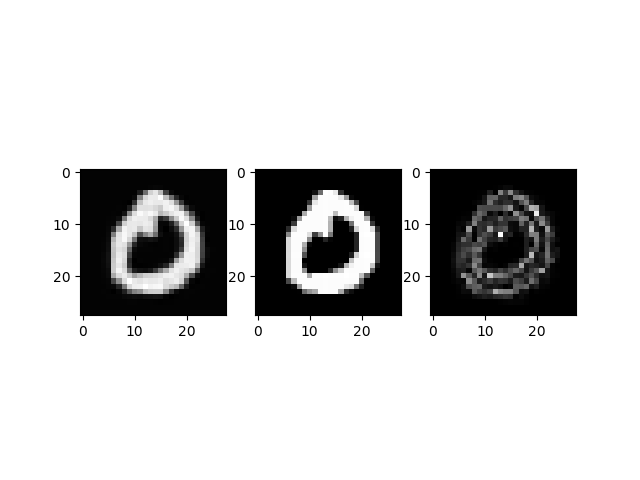

Convolutional Dictionary Learning with FISTA (Fast Iterative Shrinkage-Thresholding Algorithm).

This is an early preliminary version, slow and clunky.

Some filters...

And their effects on a test element a 0:

Maybe I'll find a better scheme for the dictionary.

Update: a line search, and a batch update were added.